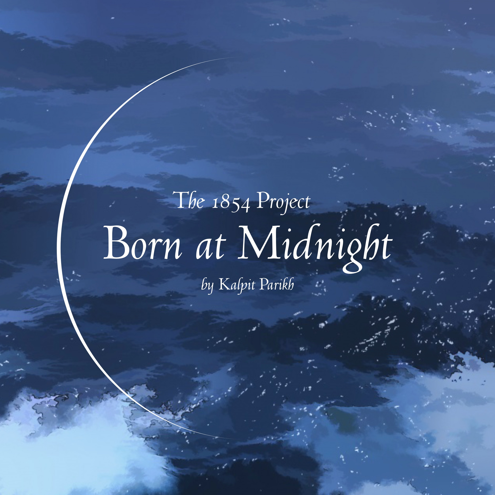
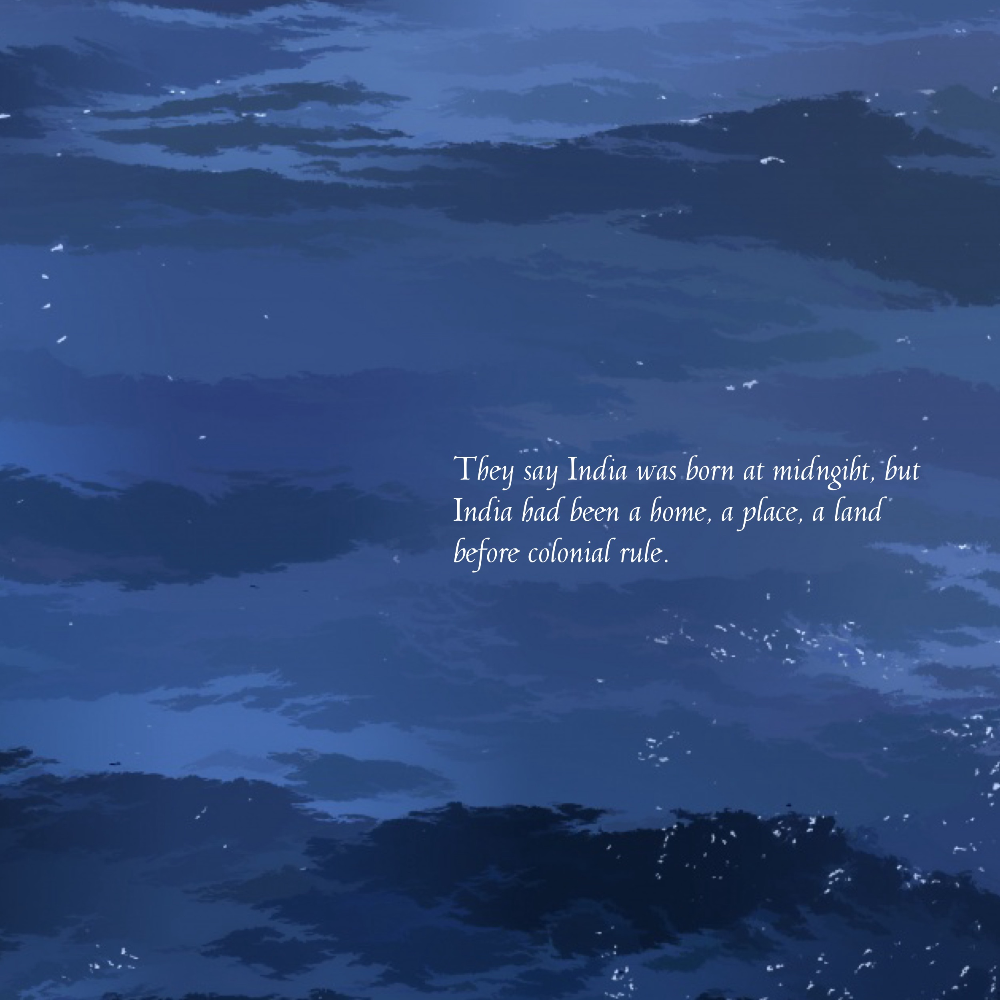

## παιδαγωγία[^1]

Born at Midnight[^2]

glimpses of India 
by 
Kalpit Parikh 

ॐ असतो मा सद्गमय । 
तमसो मा ज्योतिर्गमय । 
मृत्योर्माऽमृतं गमय ॥ 
ॐ शान्तिः शान्तिः शान्तिः ॥  

## Impressum

Published in  કલા નગરી, *kalā nagarī*: "city of art"[^3] by મન, *man*: "mind"[^4]

Cataloging in Publication Data

Name: Kalpit Parikh, 2023— author 
Title: Born at Midnight/ Kalpit Parikh 
ASIN: 
Subjects: 1. Children's Books on Indian Colonial History 2. Children's Indian Independence Movement

## Dedication

वन्देमातरम्, *vandemātaram*: "Mother, I praise thee!“

## Questions 

My teacher gives us an assignment. “Who are you?“ she asks. “Trace your roots. 
Write about where you are from.“ 

I start searching for India, but I begin to get confused.

I do not know where I begin, what my story is. 

At home, Grandma asks, “How was school?“

I tell her about the assignment, how I couldn’t finish it. 

I tell her that I am ashamed. 

Grandma gathers the whole family, says, 
“Come, let me tell you our beginning. , 
Let me tell you where we're from.“ , 

## What Grandma Tells Me

They say India was born at midngiht, 
but India had been a home, a place, a land  
before colonial rule. 

## Author's Note

This book was inspired by *Born on the Water* and similar childhood experiances and likewise hopes to show that Indians 
have their own proud origin story, one that did not begin in colonialism, in struggle, and in strife but 
that bridges the gap between India and teh World. 

## Bibliography

1. Denyer, Circe. “Abstract Ocean Painting.“ Public Domain Pictures.
2. Hannah-Jones, Nikole, and Renée Watson. The 1619 Project: Born on the Water. Illustrated by Nikkolas Smith, Kokila, 2021.
3. Nehru, Jawaharlal. “The Quest: The Panorama of India’s Past.” The Discovery of India, Oxford University Press, 1946, pp. 49-68.

[^1]: παῖς (paîs, “child”) + ἄγω (ágō, “I lead”)

[^2]: At the stroke of the midnight hour, when the world sleeps, India will awake to life and freedom (*Tryst With Destiny*)

[^3]: કલા, Classical form of કળા An art (Belsare 227) + નગર a city (Belsare 301).

[^4]: તન-મન-ધન a. n. \[See તન + મન + ધન\] Lit. The body, the mind, and
    one’s wealth. Hence, 2. All that one loves; the highest object of
    one’s ambition (Belsare 577).

